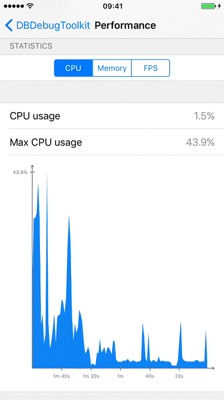
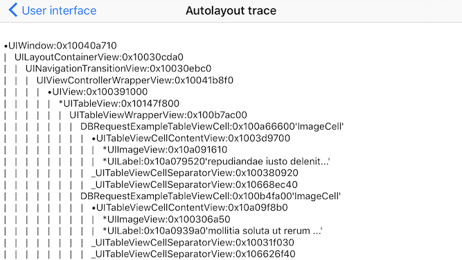
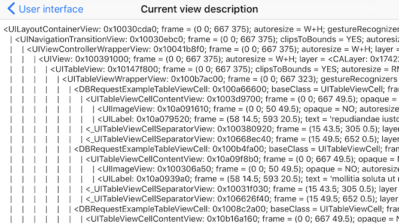
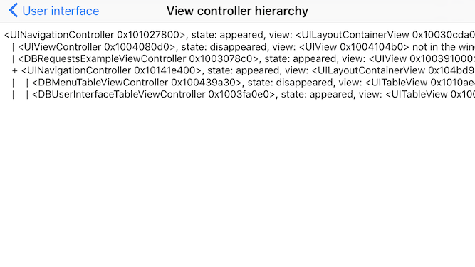
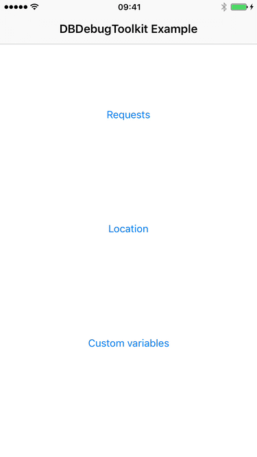
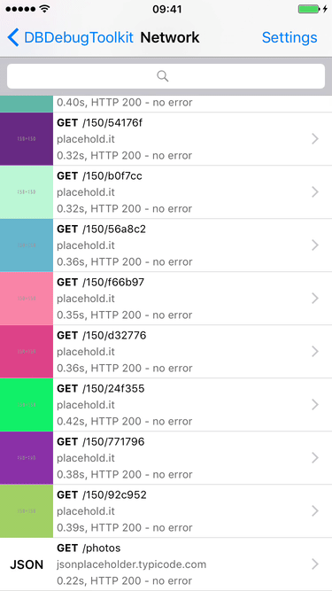
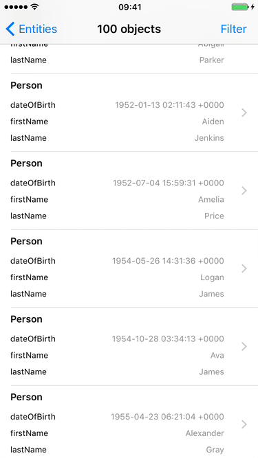
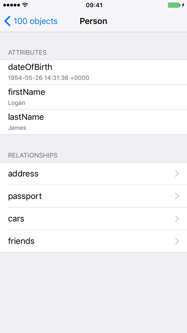
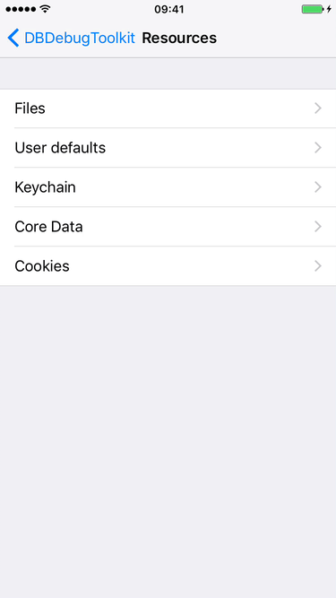
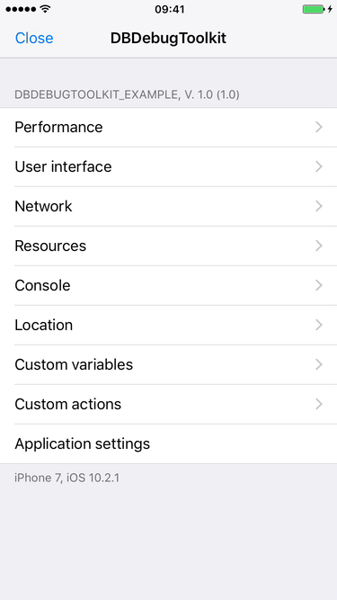

# DBDebugToolkit

[](https://travis-ci.org/dbukowski/DBDebugToolkit)
[](http://cocoapods.org/pods/DBDebugToolkit)
[](http://cocoapods.org/pods/DBDebugToolkit)
[](http://cocoapods.org/pods/DBDebugToolkit)
[](https://twitter.com/darekbukowski)

## Features

- [Performance](#performance)
- [User interface](#user-interface)
- [Network](#network)
- [Resources](#resources)
- [Console](#console)
- [Simulating location](#simulating-location)
- [Crash reports](#crash-reports)
- [Custom variables](#custom-variables)
- [Custom actions](#custom-actions)
- [Shortcut items](#shortcut-items)

### Performance

The first submenu is dedicated to measuring your application performance. You can find there statistics divided into three sections:

* CPU

   Includes current CPU usage, max CPU usage recorded and a chart displaying the CPU usage over time.

   <p align="center">
     
   </p>

* Memory

   Includes current memory usage, max memory usage recorded and a chart displaying the memory usage over time. Additionally it has a "Simulate memory warning" option.

   <p align="center">
     
   </p>

* FPS

   Includes current FPS, min FPS recorded and a chart displaying the FPS value over time.

   <p align="center">
     
   </p>

#### Widget

On top of the performance submenu you can see a switch that enables the widget displaying current CPU usage, memory usage and frames per second. The widget will stay on top of the screen and will refresh every one second. It can be moved around the screen with pan gesture.
Tapping on the widget opens the performance submenu with tapped section (CPU, memory or FPS).

<p align="center">
  
</p>

#### Simulating memory warning

In the memory section you can also find the "Simulate memory warning" button. Use it to check if you handle the warning properly.

### User interface

DBDebugToolkit provides many useful tools for UI debugging:

* Showing view frames

<p align="center">
  
</p>

* Slow animations

<p align="center">
  
</p>

* Showing touches (for screen sharing and recording)

<p align="center">
  
</p>

If your device supports 3D Touch, the touch indicator view's alpha value will depend on the touch force.

* Grid overlay

<p align="center">
  
</p>

Grid overlay is highly customizable. You can choose the size of the grid from values between 4 and 64. There are also 10 available color settings and a slider for adjusting the opacity. Due to the fact that the device screen dimensions are not always a multiple of the selected size of the grid, the grid lines are drawn from left, right, top and bottom, so you can check if your layout was implemented properly. The remaining middle parts of the grid can have a different size, which is indicated by two labels. The grid overlay stays on top of the screen at all times.

* Autolayout trace

<p align="center">
  
</p>

* Current view description

<p align="center">
  
</p>

* View controller hierarchy

<p align="center">
  
</p>

* Available font families with preview

<p align="center">
  
</p>

* Showing `UIDebuggingInformationOverlay`

`UIDebuggingInformationOverlay` is a powerful tool discovered by [Ryan Peterson](https://twitter.com/ryanipete) in the private API. Once you set up DBDebugToolkit, you can show `UIDebuggingInformationOverlay` either by selecting it in the user interface section or by tapping the status bar with two fingers. Make sure to check [Ryan's article]( http://ryanipete.com/blog/ios/swift/objective-c/uidebugginginformationoverlay/) to know more about the features it provides.

<div align="center">
  <div>
  
  </div>

</div>

Thanks to [Derek Selander](https://twitter.com/LOLgrep) `UIDebuggingInformationOverlay` is also available on iOS 11. Here is his fantastic [tutorial](https://www.raywenderlich.com/177890/swizzling-in-ios-11-with-uidebugginginformationoverlay) describing how he got around the checks imposed by Apple in this OS version.

### Network

In the network submenu you can find a list of all the requests send by your application during the current launch. There is also a search bar that allows you to filter the requests.

<p align="center">
  
</p>

Tap on any request on the list to see its details. From the request details screen you can also access the request and response body preview, that handles image, text and JSON data.

<div align="center">
  <div>
  
  </div>

</div>

The request and response body data is saved to the files to minimize the memory usage caused by the requests logging. If it happens to be too big anyway, you can disable the logging in the network submenu.

**Warning!** To provide the requests list, DBDebugToolkit uses custom `NSURLProtocol` subclass. You should always make sure to test all your requests with network logging disabled as well, as this mechanism has some drawbacks. For example, it does not support informing about the request progress (e.g. when you download a photo and you want to show a progress bar). To test your requests, you can disable the logging in the network submenu. If you need to perform more tests you can disable the logging programmatically to avoid browsing the menu too many times:

```swift
import DBDebugToolkit

func application(_ application: UIApplication, didFinishLaunchingWithOptions launchOptions: [UIApplicationLaunchOptionsKey: Any]?) -> Bool {
    DBDebugToolkit.setup()
    DBDebugToolkit.setNetworkRequestsLoggingEnabled(false)
    return true
}
```

### Resources

DBDebugToolkit allows you to browse and manage five data sources: file system, user defaults, keychain, Core Data and cookies.

#### File system

Browsing file system is really straightforward. You start in your application's directory. On top of the screen you see the label with the current path. Below are the directory contents: subdirectories and files. You can select a subdirectory to move deeper in the file system hierarchy. You can swipe a file cell to delete the file (but only if you have the needed permissions). You can also see the size of every file next to their names.

<p align="center">
  
</p>

#### User defaults and keychain

Browsing the user defaults and the keychain is very similar. For both of those data sources you can see a list of all the stored key-value pairs. Every pair can be removed by swiping the cell left and tapping the delete button. On the right of the navigation bar there is also a clear button that allows you to remove all the values stored in the currently browsed data source.

<div align="center">
  <div>
  
  </div>

</div>

Apart from that, DBDebugToolkit provides the methods that allow you to clear the user defaults or the keychain programmatically:

```swift
import DBDebugToolkit

func application(_ application: UIApplication, didFinishLaunchingWithOptions launchOptions: [UIApplicationLaunchOptionsKey: Any]?) -> Bool {
    DBDebugToolkit.clearKeychain()
    DBDebugToolkit.clearUserDefaults()
    return true
}
```

#### Core Data

DBDebugToolkit allows you to see all the objects stored in Core Data. Thanks to displaying related objects and filtering and sorting options it should be really helpful if your application uses Core Data. First, if your application uses more instances of `NSPersistentStoreCoordinator` class, you will see a list where you will need to choose one of them. This step is omitted when your application uses only one such an instance. The next screen allows you to choose one of the entities. Select an entity to see the list of all its instances:

<p align="center">
  
</p>

It's difficult to see all the managed object's attributes in a table view cell, so you can tap one of them to present a new view with all the details about the selected managed object. In the first section you can see all the attributes and their values. The second section has all the relationships. You can tap any of them to see the related objects.
In case of to-one relationships you will be redirected to the same view, but this time it will display the details of the related object:

<p align="center">
  
</p>

In case of to-many relationship you will see a view with a list of the related objects:

<p align="center">
  
</p>

On top of the view presenting the managed objects list you can see a filter button that allows you to filter the objects by their attributes and sort the results.

<p align="center">
  
</p>

#### Cookies

Browsing cookies is similar to browsing user defaults and keychain, but this time the stored data are not key-value pairs anymore. First screen displays the list of all the cookies, but only the most important data are shown: names and domains of the cookies. You can select a cookie cell to see its details on a new view. You can delete one cookie by swiping left on its cell and tapping delete button or by opening the details screen and using the navigation bar button. You can also clear all the cookies by using the clear button on the right of the navigation bar in the cookies list view.

<p align="center">
  
</p>

### Console

DBDebugToolkit displays console output inside a UITextView. The text view will be automatically scrolled down to display the new output, unless you are currently reading older entries above.

<p align="center">
  
</p>

The captured console output can be easily shared by email. The share button will open a mail compose view controller with prefilled subject containing build information and body containing device and system information and the console output.

<p align="center">
  
</p>

**Warning!** Capturing both stderr and stdout is very complicated. Stderr and stdout could be both redirected to a file that would be displayed in the text view. However, that data should be redirected back to stderr and stdout, so that you could for example see it in the console. Unfortunately it would be impossible to distinguish which data came from stderr and which came from stdout, so everything would be redirected to one of them. DBDebugToolkit is meant to be noninvasive, so this solution was unacceptable. Instead, stdout and stderr are observed in the background. The only drawback is that if you would have a loop sending data alternately to stdout and stderr you could notice a slight change in the received data order. If for some reason it is not acceptable in your project you can disable console output capturing:

```swift
import DBDebugToolkit

func application(_ application: UIApplication, didFinishLaunchingWithOptions launchOptions: [UIApplicationLaunchOptionsKey: Any]?) -> Bool {
    DBDebugToolkit.setup()
    DBDebugToolkit.setCapturingConsoleOutputEnabled(false)
    return true
}
```

### Simulating location

Simulating location with DBDebugToolkit is really straightforward. You can either select a location from the predefined list (the same as on iOS simulator) or choose any point on a map. This choice is remembered even after you relaunch the application, which should be really helpful when you work on a feature that depends on the user location.

<p align="center">
  
</p>

### Crash reports

DBDebugToolkit prepares and collects reports about your application crashes. Every crash report is saved in a file and can be seen in the menu. It contains information about the reason and the time of the crash occurence, app & system version, a screenshot captured at the moment of the crash, the whole console output and a stack trace. It can be easily shared by email, so that you can quickly report a bug to a person that can fix it.

<div align="center">
  <div>
  
  </div>

</div>

However, crash reporting in DBDebugToolkit is disabled by default. It's because there are many similar existing services, and even though there was much effort put into implementing the crash reporting in the least invasive way possible, it is not guaranteed that it will work in conjuction with them. To enable it, simply call `setupCrashReporting` method after setting up DBDebugToolkit:

```swift
import DBDebugToolkit

func application(_ application: UIApplication, didFinishLaunchingWithOptions launchOptions: [UIApplicationLaunchOptionsKey: Any]?) -> Bool {
    DBDebugToolkit.setup()
    DBDebugToolkit.setupCrashReporting()
    return true
}
```

If you are using such other services, but there are some details in DBDebugToolkit crash reports that you are interested in, it is recommended to try to enable it anyway. For example, Crashlytics works properly combined with DBDebugToolkit, but you have to remember to configure it **after** DBDebugToolkit.

Also, please note that DBDebugToolkit, just like the other services, cannot report crashes when the app is running under the debugger.

### Custom variables

DBDebugToolkit provides a powerful mechanism allowing you to change variable values during runtime. You can define string, integer, double and boolean variables that will be modifiable in the menu. For example, when you are working on a collection view, but you are not quite sure yet how to adjust the layout, you could define the variables that will let you see how the values affect the final look:

```swift
import DBDebugToolkit

override func viewDidLoad() {
    super.viewDidLoad()

    // Creating custom variables.
    let titleVariable = DBCustomVariable(name: "View title", value: "Custom variables")
    let numberOfColumnsVariable = DBCustomVariable(name: "Number of columns", value: 4)
    let minimumInteritemSpacingVariable = DBCustomVariable(name: "Minimum interitem spacing", value: 10.0)
    let showsNumbersVariable = DBCustomVariable(name: "Shows cell numbers", value: true)

    // Registering actions that will be run when the values change.
    titleVariable.addTarget(self, action: #selector(YourViewController.didUpdateTitleVariable(titleVariable:)))
    numberOfColumnsVariable.addTarget(self, action: #selector(YourViewController.didUpdateCollectionViewVariable))
    minimumInteritemSpacingVariable.addTarget(self, action: #selector(YourViewController.didUpdateCollectionViewVariable))
    showsNumbersVariable.addTarget(self, action: #selector(YourViewController.didUpdateCollectionViewVariable))

    // Adding created variables to the menu.
    DBDebugToolkit.add([ titleVariable, numberOfColumnsVariable, minimumInteritemSpacingVariable, showsNumbersVariable ])
}

// The actions that will be run when the custom variable values change.
// The method you register can have a parameter of type DBCustomVariable.
// The method will be invoked with the custom variable that changed its value, so you can use it to access the new value.
func didUpdateTitleVariable(titleVariable: DBCustomVariable) {
    self.title = titleVariable.value as! String?
}

// The method you register can have no parameters if you don't need the new value in its body.
func didUpdateCollectionViewVariable() {
    self.collectionView.reloadData()
}

// Accessing the custom variable values.
func collectionView(_ collectionView: UICollectionView, cellForItemAt indexPath: IndexPath) -> UICollectionViewCell {
    // let cell = collectionView.dequeueReusableCell...
    let showsNumbers = DBDebugToolkit.customVariable(withName: "Shows cell numbers").value as! Bool
    // Your cell configuration.
}

func collectionView(_ collectionView: UICollectionView, layout collectionViewLayout: UICollectionViewLayout, sizeForItemAt indexPath: IndexPath) -> CGSize {
    let numberOfColumns = DBDebugToolkit.customVariable(withName: "Number of columns").value as! Int
    // Calculations based on numberOfColumns value.
}

func collectionView(_ collectionView: UICollectionView, layout collectionViewLayout: UICollectionViewLayout, minimumInteritemSpacingForSectionAt section: Int) -> CGFloat {
    let interitemSpacing = DBDebugToolkit.customVariable(withName: "Minimum interitem spacing").value as! Double
    return CGFloat(interitemSpacing)
}
```

This setup allows you to modify the values in the menu and see the results immediately:

<p align="center">
  
</p>

Please remember to remove the registered actions to avoid retaining the view controller by the variable objects:

```swift
import DBDebugToolkit

override func viewWillDisappear(_ animated: Bool) {
    super.viewWillDisappear(animated)
    let titleVariable = DBDebugToolkit.customVariable(withName: "View title")
    titleVariable?.removeTarget(self, action: nil)
    // The same for the remaining variables.
}
```

If those variables are only related to that one view controller, you can also remove them completely, so that the list of variables presented in the menu is always related to the current state of your application:

```swift
import DBDebugToolkit

override func viewWillDisappear(_ animated: Bool) {
    super.viewWillDisappear(animated)
    DBDebugToolkit.removeCustomVariables(withNames: ["View title", "Shows cell numbers", "Number of columns", "Minimum interitem spacing"])
}
```

### Custom actions

If you need an easy access to any action performed by your application, you can use the custom actions feature of DBDebugToolkit. After the setup you can add as many custom actions as you like:

```swift
import DBDebugToolkit

func application(_ application: UIApplication, didFinishLaunchingWithOptions launchOptions: [UIApplicationLaunchOptionsKey: Any]?) -> Bool {
    DBDebugToolkit.setup()
    let sendReportAction = DBCustomAction(name: "Send report") {
        // Your code responsible for sending the report.
    }
    let clearDatabaseAction = DBCustomAction(name: "Clear database") {
        // Your code responsible for clearing the database.
    }
    DBDebugToolkit.add([sendReportAction, clearDatabaseAction])
    return true
}
```

To run these actions simply open the menu and go to custom actions section. You will see the list of all the actions. Tap on any of them to perform it.

<p align="center">
  
</p>

### Shortcut items

What would you do if one of the testers in your team had a crash on the app launch caused by invalid data stored in the keychain? To avoid wiping all content and settings from the device, you would probably have to prepare a special build that removes the keychain data. This can be avoided with DBDebugToolkit, as it comes now with a shortcut item that removes all the data from the keychain, user defaults, documents directory and cookies.

<p align="center">
  
</p>

To enable that option, all you have to do is add one line of code after DBDebugToolkit setup:

```swift
DBDebugToolkit.addClearDataShortcutItem()
```

Please note that overriding `UIApplication.shared.shortcutItems` after that line of code will remove this shortcut item.

**Warning!** Shortcut items are available on iOS 9.0 and above. Also, you can only use them on devices that support 3D Touch.
