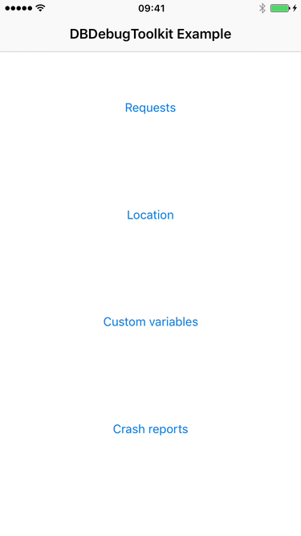

# DBDebugToolkit

[](https://travis-ci.org/dbukowski/DBDebugToolkit)
[](http://cocoapods.org/pods/DBDebugToolkit)
[](https://github.com/Carthage/Carthage)
[](http://cocoapods.org/pods/DBDebugToolkit)
[](http://cocoapods.org/pods/DBDebugToolkit)
[](https://twitter.com/darekbukowski)

DBDebugToolkit is a debugging library written in Objective-C. It is meant to provide as many easily accessible tools as possible while keeping the integration process seamless.

- [Features](#features)
- [Example](#example)
- [Requirements](#requirements)
- [Usage](#usage)
- [Author](#author)
- [Installation](#installation)
- [License](#license)

## Features

- [x] Performance
  - [x] CPU usage (current, max, chart)
  - [x] Memory usage (current, max, chart)
  - [x] FPS (current, min, chart)
  - [x] Widget displaying current CPU usage, memory usage and FPS that stays on top of the screen
  - [x] Simulating memory warning
- [x] User interface
  - [x] Showing all view frames
  - [x] Slowing down animations
  - [x] Showing touches on screen (useful for recording and screen sharing)
  - [x] Displaying customizable grid overlay on top of the screen
  - [x] Autolayout trace
  - [x] Current view description
  - [x] View controllers hierarchy
  - [x] List of available fonts with preview
  - [x] Showing UIDebuggingInformationOverlay
- [x] Network
  - [x] List of all the requests sent by the application
  - [x] Request and response preview
- [x] Resources
  - [x] File system: browsing and removing selected files
  - [x] User defaults: browsing, removing selected item and clearing all the data
  - [x] Keychain: browsing, removing selected item and clearing all the data
  - [x] Core Data: browsing all the managed objects and their relationships with sorting and filtering options
  - [x] Cookies: browsing, removing selected cookie and clearing all the data
- [x] Console
  - [x] Displaying console output in text view
  - [x] Sending console output by email with device and system information
- [x] Simulating location
- [x] Crash reports
  - [x] List of all the crashes
  - [x] Crash reports containing details, stack trace, console output and a screenshot
  - [x] Sending crash reports by email
- [x] Modifying custom variable values from the menu
- [x] Adding custom actions to the menu
- [x] Opening application settings
- [x] Application shortcut item for clearing data
- [x] Showing version & build number
- [x] Showing device model & iOS version

## Example

To run the example project, clone the repo, and run `pod install` from the Example directory first. The example project is written in Objective-C. The code examples in this README are written in Swift 3.0.

## Requirements

DBDebugToolkit requires iOS 8.0 or later.

## Usage

### Setup

DBDebugToolkit was meant to provide as many useful debugging tools as possible. However, the second equally important goal was to keep the setup seamless for all the iOS projects. A good place for setting up DBDebugToolkit is in the `AppDelegate`, as it allows it to start as quickly as possible. The simplest setup consists of only one line:

```swift
import DBDebugToolkit

func application(_ application: UIApplication, didFinishLaunchingWithOptions launchOptions: [UIApplicationLaunchOptionsKey: Any]?) -> Bool {
    DBDebugToolkit.setup()
    return true
}
```

After such setup, simply shake the device to present the menu with all the debugging options:

<p align="center">
  
</p>

Read more about triggers to find out how to customize menu presentation.

#### Triggers

Triggers are the objects that tell DBDebugToolkit to present the menu. There are 3 predefined triggers:
- `DBShakeTrigger` - reacts to shaking the device.
- `DBTapTrigger` - reacts to tapping the screen.
- `DBLongPressTrigger` - reacts to long pressing the screen.

By default, DBDebugToolkit is set up with `DBShakeTrigger`. You can also provide your own array of triggers:

```swift
import DBDebugToolkit

func application(_ application: UIApplication, didFinishLaunchingWithOptions launchOptions: [UIApplicationLaunchOptionsKey: Any]?) -> Bool {
    let tapTrigger = DBTapTrigger(numberOfTouchesRequired: 3)
    let longPressTrigger = DBLongPressTrigger(minimumPressDuration: 1.0)
    let shakeTrigger = DBShakeTrigger()
    DBDebugToolkit.setup(with: [tapTrigger, longPressTrigger, shakeTrigger])
    return true
}
```

These are just examples. Both `DBTapTrigger` and `DBLongPressTrigger` have more customization options.

You can also create your own trigger. To do this, create a class that conforms to protocol `DBDebugToolkitTrigger`. Then create an instance of this class and pass it to the setup method.

### Features

**The complete list of features with examples can now be found here:** [Features](Features.md).

## Installation

### CocoaPods

DBDebugToolkit is available through [CocoaPods](http://cocoapods.org). To install
it, simply add the following line to your Podfile:

```ruby
pod "DBDebugToolkit"
```

However, to provide some of its features, DBDebugToolkit does use private API. The code that uses it is obfuscated to minimize the risk of rejecting your application on the App Store, but it can not be guaranteed that it is enough. That being said, here are some safer ways to install DBDebugToolkit:

* Adding it only to debug builds

  It is now possible to specify the build configuration for a given pod:
  ```ruby
  pod "DBDebugToolkit", :configurations => ['Debug']
  ```
  After such setup, all your code using DBDebugToolkit needs to be placed in preprocessor macros:

  ```swift
  #if DEBUG
      import DBDebugToolkit
  #endif

  func application(_ application: UIApplication, didFinishLaunchingWithOptions launchOptions: [UIApplicationLaunchOptionsKey: Any]?) -> Bool {
      #if DEBUG
          DBDebugToolkit.setup()
      #endif
      return true
  }
  ```
  The one major drawback of such setup is the fact that it won't include DBDebugToolkit in the builds that you send to the testers.

* Creating a separate target for App Store releases

  After creating a separate target for App Store releases, your podfile could be defined this way:
  ```ruby
  def common_pods
    # Here are all the pods that will be used in both targets.
  end

  target 'YourApplication' do
      common_pods
  end

  target 'YourApplicationAppStore' do
      common_pods
      pod "DBDebugToolkit"
  end
  ```
  Then you will have to differentiate between the targets in code. To do this, you could add a custom flag to your App Store target build configuration. Assuming that you named the flag `APPSTORE`, all the code using DBDebugToolkit will be placed in preprocessor macros:
  ```swift
  #if !(APPSTORE)
      import DBDebugToolkit
  #endif

  func application(_ application: UIApplication, didFinishLaunchingWithOptions launchOptions: [UIApplicationLaunchOptionsKey: Any]?) -> Bool {
      #if !(APPSTORE)
          DBDebugToolkit.setup()
      #endif
      return true
  }
  ```

The setup with a separate target for App Store releases will help you prevent sending the build containing the private API calls included in DBDebugToolkit to the App Store review. However, you would have to remember about adding all the files to both targets during development. You will have to decide which way is the best for your project. Perhaps it will be easier to manually remove DBDebugToolkit from the podfile before each App Store release.

### Carthage

To integrate DBDebugToolkit into your Xcode project using Carthage, specify it in your Cartfile:
```ruby
github "dbukowski/DBDebugToolkit" ~> 0.5.0
```
Run carthage update to build the framework and drag the built DBDebugToolkit.framework into your Xcode project.

## Author

Dariusz Bukowski, dariusz.m.bukowski@gmail.com

## License

DBDebugToolkit is available under the MIT license. See the LICENSE file for more info.
